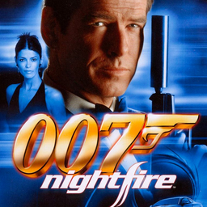

# 007: Nightfire

## PS2 Saves - SLUS20579

| Icon | Filename | Description |
|------|----------|-------------|
|  | [00000001.zip](00000001.zip){: .btn .btn-purple } | BASLUS-20579TJN: 007: NightFireTJN (22620_007__Night_459027.max) |
|  | [00000002.zip](00000002.zip){: .btn .btn-purple } | BASLUS-20579007: 007: NightFire007 (1_007__Night_800152.max) |
|  | [00000003.zip](00000003.zip){: .btn .btn-purple } | BASLUS-20579BIG  G: 007: NightFireBIG  G (10313_007__Night_830807.max) |
|  | [00000004.zip](00000004.zip){: .btn .btn-purple } | BASLUS-20579BOND: 007: NightFireBOND (1_007__Night_560009.max) |
|  | [00000005.zip](00000005.zip){: .btn .btn-purple } | BASLUS-20579DEREK: 007: NightFireDEREK (3190_007__Night_619656.max) |
