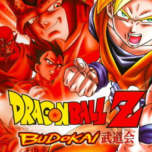

# Dragon Ball Z: Budokai

## PS2 Saves - SLUS20591

| Icon | Filename | Description |
|------|----------|-------------|
|  | [00000001.zip](00000001.zip){: .btn .btn-purple } | BASLUS-20591DBZ: DRAGON BALL ZGAME DATA (3158_DRAGON_BAL_726742.max) |
|  | [00000002.zip](00000002.zip){: .btn .btn-purple } | BASLUS-20591DBZ: DRAGON BALL ZGAME DATA (1_DRAGON_BAL_959743.max) |
|  | [00000003.zip](00000003.zip){: .btn .btn-purple } | BASLUS-20591DBZ: DRAGON BALL ZGAME DATA (11501_DRAGON_BAL_636608.max) |
|  | [00000004.zip](00000004.zip){: .btn .btn-purple } | BASLUS-20591DBZ: DRAGON BALL ZGAME DATA (1_DRAGON_BAL_460919.max) |
|  | [00000005.zip](00000005.zip){: .btn .btn-purple } | BASLUS-20591DBZ: DRAGON BALL ZGAME DATA (939_DRAGON_BAL_419567.max) |
|  | [00000006.zip](00000006.zip){: .btn .btn-purple } | BASLUS-20591DBZ: DRAGON BALL ZGAME DATA (10820_DRAGON_BAL_60483.max) |
|  | [00000007.zip](00000007.zip){: .btn .btn-purple } | BASLUS-20591DBZ: DRAGON BALL ZGAME DATA (4959_DRAGON_BAL_821438.max) |
|  | [00000008.zip](00000008.zip){: .btn .btn-purple } | BASLUS-20591DBZ: DRAGON BALL ZGAME DATA (11689_DRAGON_BAL_913402.max) |
|  | [00000009.zip](00000009.zip){: .btn .btn-purple } | BASLUS-20591DBZ: DRAGON BALL ZGAME DATA (1_DRAGON_BAL_913524.max) |
|  | [00000010.zip](00000010.zip){: .btn .btn-purple } | BASLUS-20591DBZ: DRAGON BALL ZGAME DATA (3349_Dragon_Bal_892147.max) |
|  | [00000011.zip](00000011.zip){: .btn .btn-purple } | BASLUS-20591DBZ: DRAGON BALL ZGAME DATA (1_DRAGON_BAL_175351.max) |
|  | [00000100.zip](00000100.zip){: .btn .btn-purple } | Everything Unlocked. |
