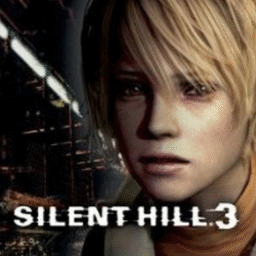

# Silent Hill 3

## PS2 Saves - SLUS20622

| Icon | Filename | Description |
|------|----------|-------------|
|  | [00000001.zip](00000001.zip){: .btn .btn-purple } | BASLUS-20622File: SILENT HILL 3 File (3992_SILENT_HIL_383084.max) |
|  | [00000002.zip](00000002.zip){: .btn .btn-purple } | BASLUS-20622File: SILENT HILL 3 File (27512_SILENT_HIL_336666.max) |
|  | [00000003.zip](00000003.zip){: .btn .btn-purple } | BASLUS-20622File: SILENT HILL 3 File (17851_SILENT_HIL_674252.max) |
|  | [00000004.zip](00000004.zip){: .btn .btn-purple } | BASLUS-20622File: SILENT HILL 3 File (3278_SILENT_HIL_232373.max) |
|  | [00000005.zip](00000005.zip){: .btn .btn-purple } | BASLUS-20622File: SILENT HILL 3 File (4503_SILENT_HIL_305157.max) |
|  | [00000006.zip](00000006.zip){: .btn .btn-purple } | BASLUS-20622File: SILENT HILL 3 File (26087_SILENT_HIL_452679.max) |
|  | [00000007.zip](00000007.zip){: .btn .btn-purple } | BASLUS-20622File: SILENT HILL 3 File (25514_Silent_Hil_136426.max) |
