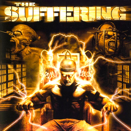

# The Suffering

## PS2 Saves - SLUS20636

| Icon | Filename | Description |
|------|----------|-------------|
|  | [00000001.zip](00000001.zip){: .btn .btn-purple } | BASLUS-20636Settings: The Suffering Settings (1_The_Suffer_550625.max) |
|  | [00000002.zip](00000002.zip){: .btn .btn-purple } | BASLUS-20636Settings: The Suffering Settings (1_The_Suffer_534207.max) |
|  | [00000003.zip](00000003.zip){: .btn .btn-purple } | BASLUS-20636d8a: The Suffering Save Game(1) (1_The_Suffer_134442.max) |
|  | [00000004.zip](00000004.zip){: .btn .btn-purple } | BASLUS-20636e0e: The Suffering Save Game(1) (9647_The_Suffer_944271.max) |
|  | [00000005.zip](00000005.zip){: .btn .btn-purple } | BASLUS-20636d8a: The Suffering Save Game(1) (1_The_Suffer_679897.max) |
