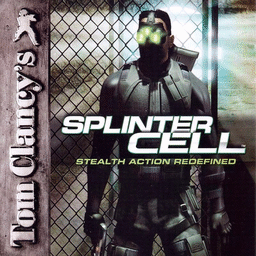

# Tom Clancy's Splinter Cell

## PS2 Saves - SLUS20652

| Icon | Filename | Description |
|------|----------|-------------|
|  | [00000001.zip](00000001.zip){: .btn .btn-purple } | BASLUS-20652: Splinter Cell (1_Splinter_C_14325.max) |
|  | [00000002.zip](00000002.zip){: .btn .btn-purple } | BASLUS-20652: Splinter Cell (400_Splinter_C_184323.max) |
|  | [00000003.zip](00000003.zip){: .btn .btn-purple } | BASLUS-20652: Splinter Cell (10227_Splinter_C_585049.max) |
|  | [00000004.zip](00000004.zip){: .btn .btn-purple } | BASLUS-20652: Splinter Cell (9085_Splinter_C_268414.max) |
|  | [00000005.zip](00000005.zip){: .btn .btn-purple } | BASLUS-20652: Splinter Cell (1_Splinter_C_800640.max) |
