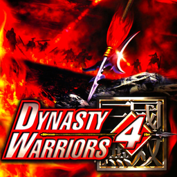

# Dynasty Warriors 4

## PS2 Saves - SLUS20653

| Icon | Filename | Description |
|------|----------|-------------|
|  | [00000001.zip](00000001.zip){: .btn .btn-purple } | BASLUS-20653: Dynasty Warriors 4 (1_Dynasty_Wa_371548.max) |
|  | [00000002.zip](00000002.zip){: .btn .btn-purple } | BASLUS-20653: Dynasty Warriors 4 (1_Dynasty_Wa_6894.max) |
|  | [00000003.zip](00000003.zip){: .btn .btn-purple } | BASLUS-20653: Dynasty Warriors 4 (1_Dynasty_Wa_816799.max) |
|  | [00000004.zip](00000004.zip){: .btn .btn-purple } | BASLUS-20653: Dynasty Warriors 4 (5206_Dynasty_Wa_715908.max) |
|  | [00000005.zip](00000005.zip){: .btn .btn-purple } | BASLUS-20653: Dynasty Warriors 4 (1909_Dynasty_Wa_448681.max) |
|  | [00000006.zip](00000006.zip){: .btn .btn-purple } | BASLUS-20653: Dynasty Warriors 4 (6424_Dynasty_Wa_150555.max) |
|  | [00000100.zip](00000100.zip){: .btn .btn-purple } | Pretty Much Everything. All Movies, Options, Levels, Characters, Character Points And Weapons |
