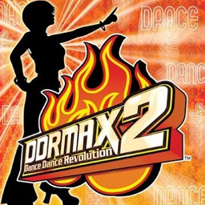

# DDRMAX2: Dance Dance Revolution

## PS2 Saves - SLUS20711

| Icon | Filename | Description |
|------|----------|-------------|
|  | [00000001.zip](00000001.zip){: .btn .btn-purple } | BASLUS-20711system: DDRMAX2   SYSTEM                (464_DDRMAX2__S_806652.max) |
|  | [00000002.zip](00000002.zip){: .btn .btn-purple } | BASLUS-20711system: DDRMAX2   SYSTEM                (275_DDRMAX2__S_393399.max) |
|  | [00000003.zip](00000003.zip){: .btn .btn-purple } | BASLUS-20711system: DDRMAX2   SYSTEM                (10122_DDRMAX2__S_320935.max) |
|  | [00000004.zip](00000004.zip){: .btn .btn-purple } | BASLUS-20711system: DDRMAX2   SYSTEM                (1_DDRMAX2____904766.max) |
|  | [00000005.zip](00000005.zip){: .btn .btn-purple } | BASLUS-20711system: DDRMAX2   SYSTEM                (4958_DDRMAX2__S_889110.max) |
