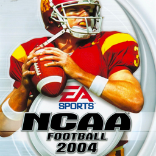

# NCAA Football 2004

## PS2 Saves - SLUS20719

| Icon | Filename | Description |
|------|----------|-------------|
|  | [00000001.zip](00000001.zip){: .btn .btn-purple } | BASLUS-20719RNCAA04: NCAA RosterNCAA04 (1_NCAA_Roste_5505.max) |
|  | [00000002.zip](00000002.zip){: .btn .btn-purple } | BASLUS-20719CTAMUCC: NCAA CrSchlTAMUCC (1530_NCAA_CrSch_646160.max) |
|  | [00000003.zip](00000003.zip){: .btn .btn-purple } | BASLUS-20719PChuck: NCAA ProfileChuck (2209_NCAA_Profi_646679.max) |
|  | [00000004.zip](00000004.zip){: .btn .btn-purple } | BASLUS-20719RRost1: NCAA RosterRost1 (4584_NCAA_Roste_58987.max) |
|  | [00000005.zip](00000005.zip){: .btn .btn-purple } | BASLUS-20719RRost2: NCAA RosterRost2 (195_NCAA_2004__134121.max) |
|  | [00000006.zip](00000006.zip){: .btn .btn-purple } | BASLUS-20719LClass03: NCAA Draft ClassClass03 (1475_NCAA_Draft_471813.max) |
|  | [00000007.zip](00000007.zip){: .btn .btn-purple } | BASLUS-20719LClass03: NCAA Draft ClassClass03 (1530_NCAA_Draft_92847.max) |
|  | [00000008.zip](00000008.zip){: .btn .btn-purple } | BASLUS-20719LClass04: NCAA Draft ClassClass04 (1530_NCAA_Draft_862011.max) |
|  | [00000009.zip](00000009.zip){: .btn .btn-purple } | BASLUS-20719RRost2: NCAA RosterRost2 (1066_NCAA_Roste_554882.max) |
|  | [00000010.zip](00000010.zip){: .btn .btn-purple } | BASLUS-20719CNLD: NCAA CrSchlNLD (9358_NCAA_CrSch_372494.max) |
