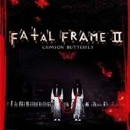

# Fatal Frame II: Crimson Butterfly

## PS2 Saves - SLUS20766

| Icon | Filename | Description |
|------|----------|-------------|
|  | [00000001.zip](00000001.zip){: .btn .btn-purple } | BASLUS-20766ZERO-BD: FATAL FRAME2GameData (1_FATAL_FRAM_506481.max) |
|  | [00000002.zip](00000002.zip){: .btn .btn-purple } | BASLUS-20766ZERO-BD: FATAL FRAME2GameData (1_FATAL_FRAM_470700.max) |
|  | [00000003.zip](00000003.zip){: .btn .btn-purple } | BASLUS-20766ZERO-BD: FATAL FRAME2GameData (1392_FATAL_FRAM_440197.max) |
|  | [00000004.zip](00000004.zip){: .btn .btn-purple } | BASLUS-20766ZERO-BD: FATAL FRAME2GameData (1_FATAL_FRAM_770229.max) |
|  | [00000005.zip](00000005.zip){: .btn .btn-purple } | BASLUS-20766ZERO-BD: FATAL FRAME2GameData (1_FATAL_FRAM_414212.max) |
|  | [00000006.zip](00000006.zip){: .btn .btn-purple } | BASLUS-20766ZERO-BD: FATAL FRAME2GameData (1_FATAL_FRAM_534908.max) |
|  | [00000007.zip](00000007.zip){: .btn .btn-purple } | BASLUS-20766ZERO-BD: FATAL FRAME2GameData (1_FATAL_FRAM_819546.max) |
|  | [00000008.zip](00000008.zip){: .btn .btn-purple } | BASLUS-20766ZERO-BD: FATAL FRAME2GameData (6195_FATAL_FRAM_898189.max) |
