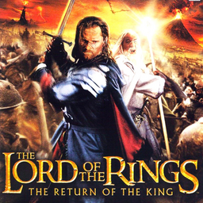

# The Lord of the Rings: The Return of the King

## PS2 Saves - SLUS20770

| Icon | Filename | Description |
|------|----------|-------------|
|  | [00000001.zip](00000001.zip){: .btn .btn-purple } | BASLUS-20770LOTRROTK: The Returnof the King (4707_The_Return_375042.max) |
|  | [00000002.zip](00000002.zip){: .btn .btn-purple } | BASLUS-20770LOTRROTK: The Returnof the King (14451_The_Return_741924.max) |
|  | [00000003.zip](00000003.zip){: .btn .btn-purple } | BASLUS-20770LOTRROTK: The Returnof the King (5356_The_Return_736767.max) |
|  | [00000004.zip](00000004.zip){: .btn .btn-purple } | BASLUS-20770LOTRROTK: The Returnof the King (8029_The_Return_676403.max) |
|  | [00000005.zip](00000005.zip){: .btn .btn-purple } | BASLUS-20770LOTRROTK: The Returnof the King (15618_The_Return_2743.max) |
|  | [00000006.zip](00000006.zip){: .btn .btn-purple } | BASLUS-20770LOTRROTK: The Returnof the King (1_The_Return_238232.max) |
|  | [00000007.zip](00000007.zip){: .btn .btn-purple } | BASLUS-20770LOTRROTK: The Returnof the King (15705_The_Return_248242.max) |
