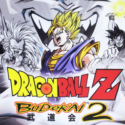

# Dragon Ball Z: Budokai 2

## PS2 Saves - SLUS20779

| Icon | Filename | Description |
|------|----------|-------------|
|  | [00000001.zip](00000001.zip){: .btn .btn-purple } | BASLUS-20779DBZ2: DRAGON BALL ZBUDOKAI2 (9266_DRAGON_BAL_971569.max) |
|  | [00000002.zip](00000002.zip){: .btn .btn-purple } | BASLUS-20779DBZ2: DRAGON BALL ZBUDOKAI2 (6439_DRAGON_BAL_282360.max) |
|  | [00000003.zip](00000003.zip){: .btn .btn-purple } | BASLUS-20779DBZ2: DRAGON BALL ZBUDOKAI2 (4465_DRAGON_BAL_637096.max) |
|  | [00000004.zip](00000004.zip){: .btn .btn-purple } | BASLUS-20779DBZ2: AR MAX DRAGON BALL ZBUDOKAI2  (1_AR_MAX_DRA_887646.max) |
|  | [00000005.zip](00000005.zip){: .btn .btn-purple } | BASLUS-20779DBZ2: DRAGON BALL ZBUDOKAI2 (939_DRAGON_BAL_159390.max) |
|  | [00000006.zip](00000006.zip){: .btn .btn-purple } | BASLUS-20779DBZ2: DRAGON BALL ZBUDOKAI2 (1_DRAGON_BAL_402310.max) |
|  | [00000007.zip](00000007.zip){: .btn .btn-purple } | BASLUS-20779DBZ2: DRAGON BALL ZBUDOKAI2 (6236_DRAGON_BAL_379788.max) |
|  | [00000008.zip](00000008.zip){: .btn .btn-purple } | BASLUS-20779DBZ2: DRAGON BALL ZBUDOKAI2 (1_DRAGON_BAL_652935.max) |
|  | [00000009.zip](00000009.zip){: .btn .btn-purple } | BASLUS-20779DBZ2: DRAGON BALL ZBUDOKAI2 (3349_Dragon_Bal_138806.max) |
|  | [00000010.zip](00000010.zip){: .btn .btn-purple } | BASLUS-20779DBZ2: DRAGON BALL ZBUDOKAI2 (1_DRAGON_BAL_112408.max) |
|  | [00000011.zip](00000011.zip){: .btn .btn-purple } | BASLUS-20779DBZ2: DRAGON BALL ZBUDOKAI2 (1_DRAGON_BAL_103329.max) |
|  | [00000012.zip](00000012.zip){: .btn .btn-purple } | BASLUS-20779DBZ2: DRAGON BALL ZBUDOKAI2 (3536_DRAGON_BAL_395108.max) |
|  | [00000013.zip](00000013.zip){: .btn .btn-purple } | BASLUS-20779DBZ2: DRAGON BALL ZBUDOKAI2 (1_DRAGON_BAL_202115.max) |
|  | [00000014.zip](00000014.zip){: .btn .btn-purple } | BASLUS-20779DBZ2: DRAGON BALL ZBUDOKAI2 (10377_DRAGON_BAL_123730.max) |
|  | [00000015.zip](00000015.zip){: .btn .btn-purple } | BASLUS-20779DBZ2: DRAGON BALL ZBUDOKAI2 (1_DRAGON_BAL_605129.max) |
|  | [00000016.zip](00000016.zip){: .btn .btn-purple } | BASLUS-20779DBZ2: DRAGON BALL ZBUDOKAI2 (1_DRAGON_BAL_371685.max) |
|  | [00000017.zip](00000017.zip){: .btn .btn-purple } | BASLUS-20779DBZ2: DRAGON BALL ZBUDOKAI2 (1_DRAGON_BAL_347653.max) |
|  | [00000018.zip](00000018.zip){: .btn .btn-purple } | BASLUS-20779DBZ2: DRAGON BALL ZBUDOKAI2 (971_Dragonball_845150.max) |
|  | [00000019.zip](00000019.zip){: .btn .btn-purple } | BASLUS-20779DBZ2: DRAGON BALL ZBUDOKAI2 (6439_DRAGON_BAL_107556.max) |
|  | [00000020.zip](00000020.zip){: .btn .btn-purple } | BASLUS-20779DBZ2: DRAGON BALL ZBUDOKAI2 (3915_DRAGON_BAL_434048.max) |
|  | [00000021.zip](00000021.zip){: .btn .btn-purple } | BASLUS-20779DBZ2: DRAGON BALL ZBUDOKAI2 (1_DRAGON_BAL_707867.max) |
|  | [00000022.zip](00000022.zip){: .btn .btn-purple } | BASLUS-20779DBZ2: DRAGON BALL ZBUDOKAI2 (1_DRAGON_BAL_241192.max) |
|  | [00000023.zip](00000023.zip){: .btn .btn-purple } | BASLUS-20779DBZ2: DRAGON BALL ZBUDOKAI2 (525_DRAGON_BAL_909267.max) |
|  | [00000024.zip](00000024.zip){: .btn .btn-purple } | BASLUS-20779DBZ2: DRAGON BALL ZBUDOKAI2 (5767_DRAGON_BAL_648205.max) |
|  | [00000025.zip](00000025.zip){: .btn .btn-purple } | BASLUS-20779DBZ2: AR MAX DRAGON BALL ZBUDOKAI2  (1_AR_MAX_DRA_482723.max) |
|  | [00000026.zip](00000026.zip){: .btn .btn-purple } | BASLUS-20779DBZ2: DRAGON BALL ZBUDOKAI2 (2607_DRAGON_BAL_842586.max) |
|  | [00000027.zip](00000027.zip){: .btn .btn-purple } | BASLUS-20779DBZ2: DRAGON BALL ZBUDOKAI2 (1_DRAGON_BAL_243496.max) |
|  | [00000028.zip](00000028.zip){: .btn .btn-purple } | BASLUS-20779DBZ2: DRAGON BALL ZBUDOKAI2 (5563_Dragonball_609478.max) |
|  | [00000029.zip](00000029.zip){: .btn .btn-purple } | BASLUS-20779DBZ2: DRAGON BALL ZBUDOKAI2 (1_DRAGON_BAL_737255.max) |
|  | [00000030.zip](00000030.zip){: .btn .btn-purple } | BASLUS-20779DBZ2: DRAGON BALL ZBUDOKAI2 (1_DRAGON_BAL_404034.max) |
|  | [00000031.zip](00000031.zip){: .btn .btn-purple } | BASLUS-20779DBZ2: DRAGON BALL ZBUDOKAI2 (1_DRAGON_BAL_567181.max) |
|  | [00000032.zip](00000032.zip){: .btn .btn-purple } | BASLUS-20779DBZ2: DRAGON BALL ZBUDOKAI2 (4931_DRAGON_BAL_542507.max) |
|  | [00000033.zip](00000033.zip){: .btn .btn-purple } | BASLUS-20779DBZ2: DRAGON BALL ZBUDOKAI2 (1_DRAGON_BAL_55188.max) |
|  | [00000034.zip](00000034.zip){: .btn .btn-purple } | BASLUS-20779DBZ2: DRAGON BALL ZBUDOKAI2 (5194_DRAGON_BAL_874965.max) |
|  | [00000035.zip](00000035.zip){: .btn .btn-purple } | BASLUS-20779DBZ2: DRAGON BALL ZBUDOKAI2 (1_DRAGON_BAL_283474.max) |
|  | [00000036.zip](00000036.zip){: .btn .btn-purple } | BASLUS-20779DBZ2: DRAGON BALL ZBUDOKAI2 (3158_DRAGON_BAL_386532.max) |
|  | [00000037.zip](00000037.zip){: .btn .btn-purple } | BASLUS-20779DBZ2: DRAGON BALL ZBUDOKAI2 (7997_DRAGON_BAL_346737.max) |
