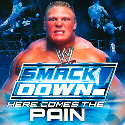

# WWE SmackDown! Here Comes the Pain

## PS2 Saves - SLUS20787

| Icon | Filename | Description |
|------|----------|-------------|
|  | [00000001.zip](00000001.zip){: .btn .btn-purple } | BASLUS-20787SD5: SmackDown!HCP (664_SmackDown!_459515.max) |
|  | [00000002.zip](00000002.zip){: .btn .btn-purple } | BASLUS-20787SD5: The Great One's Ultimate Caw Sa (1_The_Great__806606.max) |
|  | [00000003.zip](00000003.zip){: .btn .btn-purple } | BASLUS-20787SD5: WWE Updated Roster : Created By (1_WWE_Update_361843.max) |
|  | [00000004.zip](00000004.zip){: .btn .btn-purple } | BASLUS-20787SD5: DC Comics CAWS (1_DC_Comics__148221.max) |
|  | [00000005.zip](00000005.zip){: .btn .btn-purple } | BASLUS-20787SD5: NWA-TNA Save Vol: 1 - Credit Da (1_NWA_TNA_Sa_994136.max) |
|  | [00000006.zip](00000006.zip){: .btn .btn-purple } | BASLUS-20787SD5: SmackDown!HCP Spider-Man/Avenge (1_SmackDown!_137875.max) |
|  | [00000007.zip](00000007.zip){: .btn .btn-purple } | BASLUS-20787SD5: ECW Roster - ECW,ECW,ECW!!!! (1_ECW_Roster_655956.max) |
|  | [00000008.zip](00000008.zip){: .btn .btn-purple } | BASLUS-20787SD5: Updated RAW Roster Save - Credi (1_Updated_RA_933071.max) |
|  | [00000009.zip](00000009.zip){: .btn .btn-purple } | BASLUS-20787SD5: SmackDown!HCP (514_SmackDown!_467205.max) |
|  | [00000010.zip](00000010.zip){: .btn .btn-purple } | BASLUS-20787SD5: WCW Caws 1999-2001 (1_WCW_Caws_1_361843.max) |
|  | [00000011.zip](00000011.zip){: .btn .btn-purple } | BASLUS-20787SD5: SmackDown!HCP NWA TNA (1_SmackDown!_877651.max) |
|  | [00000012.zip](00000012.zip){: .btn .btn-purple } | BASLUS-20787SD5: SmackDown!HCP NWA TNA roster (1_SmackDown!_240216.max) |
|  | [00000013.zip](00000013.zip){: .btn .btn-purple } | BASLUS-20787SD5: SmackDown!HCP (1198_SmackDown!_548931.max) |
|  | [00000014.zip](00000014.zip){: .btn .btn-purple } | BASLUS-20787SD5: SmackDown!HCP NWO roster (1_SmackDown!_243451.max) |
|  | [00000015.zip](00000015.zip){: .btn .btn-purple } | BASLUS-20787SD5: NWA/WCW Save 1 Created By Monit (1_NWA_WCW_Sa_561199.max) |
|  | [00000016.zip](00000016.zip){: .btn .btn-purple } | BASLUS-20787SD5: NWA-TNA Save Vol:2 (1_NWA_TNA_Sa_201764.max) |
|  | [00000017.zip](00000017.zip){: .btn .btn-purple } | BASLUS-20787SD5: SmackDown!HCP (185_SmackDown!_110379.max) |
|  | [00000018.zip](00000018.zip){: .btn .btn-purple } | BASLUS-20787SD5: SmackDown!HCP (2104_SmackDown!_168408.max) |
|  | [00000019.zip](00000019.zip){: .btn .btn-purple } | BASLUS-20787SD5: X-Men CAWS (1_X_Men_CAWS_688839.max) |
|  | [00000020.zip](00000020.zip){: .btn .btn-purple } | BASLUS-20787SD5: SmackDown!HCP (1_SmackDown!_366024.max) |
|  | [00000021.zip](00000021.zip){: .btn .btn-purple } | BASLUS-20787SD5: Dan Fookes' Misc Save - Credit  (1_Dan_Fookes_497784.max) |
|  | [00000022.zip](00000022.zip){: .btn .btn-purple } | BASLUS-20787SD5: Japan Caws (1_Japan_Caws_680340.max) |
|  | [00000023.zip](00000023.zip){: .btn .btn-purple } | BASLUS-20787SD5: WWF 1999-2000 Roster - Created  (1_WWF_1999_2_37747.max) |
|  | [00000024.zip](00000024.zip){: .btn .btn-purple } | BASLUS-20787SD5: WWE lengends 1960 thru 90s (1_WWE_lengen_136700.max) |
|  | [00000025.zip](00000025.zip){: .btn .btn-purple } | BASLUS-20787SD5: SmackDown!HCP (2523_SmackDown!_525814.max) |
|  | [00000026.zip](00000026.zip){: .btn .btn-purple } | BASLUS-20787SD5: WWE mid 90s Vol 2 (1_WWE_mid_90_496334.max) |
|  | [00000027.zip](00000027.zip){: .btn .btn-purple } | BASLUS-20787SD5: SmackDown!HCP (2937_SmackDown!_227169.max) |
|  | [00000028.zip](00000028.zip){: .btn .btn-purple } | BASLUS-20787SD5: Alternate Attires For Ingame Wr (1_Alternate__218716.max) |
|  | [00000029.zip](00000029.zip){: .btn .btn-purple } | BASLUS-20787SD5: NWO save 1998 to 2000 (1_NWO_save_1_6329.max) |
|  | [00000030.zip](00000030.zip){: .btn .btn-purple } | BASLUS-20787SD5: Smackdown Updated Roster- Creat (1_Smackdown__228772.max) |
|  | [00000031.zip](00000031.zip){: .btn .btn-purple } | BASLUS-20787SD5: Born 2 Box's CAWs Save (1_Born_2_Box_974361.max) |
|  | [00000032.zip](00000032.zip){: .btn .btn-purple } | BASLUS-20787SD5: WWF Early 90's (1_WWF_Early__64633.max) |
|  | [00000033.zip](00000033.zip){: .btn .btn-purple } | BASLUS-20787SD5: SmackDown!HCP (3160_SmackDown!_51312.max) |
|  | [00000034.zip](00000034.zip){: .btn .btn-purple } | BASLUS-20787SD5: Lengends Vol:1 Created By Jsig (1_Lengends_V_322995.max) |
|  | [00000035.zip](00000035.zip){: .btn .btn-purple } | BASLUS-20787SD5: SmackDown!HCP (522_SmackDown!_684277.max) |
|  | [00000036.zip](00000036.zip){: .btn .btn-purple } | BASLUS-20787SD5: SmackDown!HCP (1974_SmackDown!_657192.max) |
