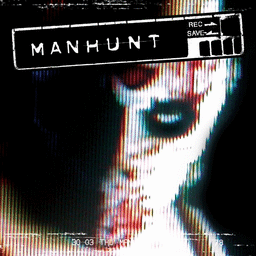

# Manhunt

## PS2 Saves - SLUS20827

| Icon | Filename | Description |
|------|----------|-------------|
|  | [00000001.zip](00000001.zip){: .btn .btn-purple } | BASLUS-20827MANHUNT: Manhunt (1430_Manhunt_698315.max) |
|  | [00000002.zip](00000002.zip){: .btn .btn-purple } | BASLUS-20827MANHUNT: Manhunt (7969_Manhunt_un_362225.max) |
|  | [00000003.zip](00000003.zip){: .btn .btn-purple } | BASLUS-20827MANHUNT: Manhunt (1_Manhunt_67029.max) |
|  | [00000004.zip](00000004.zip){: .btn .btn-purple } | BASLUS-20827MANHUNT: Manhunt (16077_Manhunt_43927.max) |
|  | [00000005.zip](00000005.zip){: .btn .btn-purple } | BASLUS-20827MANHUNT: Manhunt (9028_Manhunt_701763.max) |
|  | [00000006.zip](00000006.zip){: .btn .btn-purple } | BASLUS-20827MANHUNT: Manhunt (13671_Manhunt_559368.max) |
