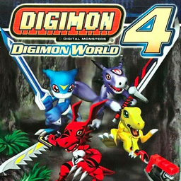

# Digimon World 4

## PS2 Saves - SLUS20836

| Icon | Filename | Description |
|------|----------|-------------|
|  | [00000001.zip](00000001.zip){: .btn .btn-purple } | BASLUS-20836savedata: DigimonWorld4SaveData (1_DigimonWor_202298.max) |
|  | [00000002.zip](00000002.zip){: .btn .btn-purple } | BASLUS-20836savedata: DigimonWorld4 ps2 max drive sav (1_DigimonWor_126141.max) |
|  | [00000003.zip](00000003.zip){: .btn .btn-purple } | BASLUS-20836savedata: DigimonWorld4SaveDataOguz (1_DigimonWor_975612.max) |
|  | [00000004.zip](00000004.zip){: .btn .btn-purple } | BASLUS-20836savedata: DigimonWorld4SaveDataoguz (1_DigimonWor_871700.max) |
|  | [00000005.zip](00000005.zip){: .btn .btn-purple } | BASLUS-20836savedata: DigimonWorld4SaveData (1_DigimonWor_790630.max) |
|  | [00000006.zip](00000006.zip){: .btn .btn-purple } | BASLUS-20836savedata: DigimonWorld4SaveData (1_DigimonWor_133328.max) |
|  | [00000007.zip](00000007.zip){: .btn .btn-purple } | BASLUS-20836savedata: DigimonWorld4 ps2 max drive sav (1_DigimonWor_309750.max) |
|  | [00000008.zip](00000008.zip){: .btn .btn-purple } | BASLUS-20836savedata: DigimonWorld4SaveData (1_DigimonWor_104596.max) |
|  | [00000009.zip](00000009.zip){: .btn .btn-purple } | BASLUS-20836savedata: DigimonWorld4 ps2 max drive sav (1_DigimonWor_952953.max) |
