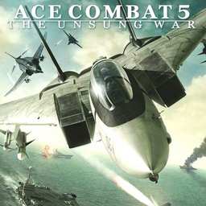

# Ace Combat 5: The Unsung War

## PS2 Saves - SLUS20851

| Icon | Filename | Description |
|------|----------|-------------|
|  | [00000001.zip](00000001.zip){: .btn .btn-purple } | BASLUS-20851AC5: ACE COMBAT 5 SAVE DATA (1_ACE_COMBAT_327587.max) |
|  | [00000002.zip](00000002.zip){: .btn .btn-purple } | BASLUS-20851AC5: ACE COMBAT 5 SAVE DATA (1_ACE_COMBAT_656002.max) |
|  | [00000003.zip](00000003.zip){: .btn .btn-purple } | BASLUS-20851AC5: ACE COMBAT 5 SAVE DATA (1_ACE_COMBAT_50992.max) |
|  | [00000004.zip](00000004.zip){: .btn .btn-purple } | BASLUS-20851AC5: ACE COMBAT 5 SAVE DATA (1_ACE_COMBAT_762844.max) |
|  | [00000005.zip](00000005.zip){: .btn .btn-purple } | BASLUS-20851AC5: ACE COMBAT SQUADRON LEADER (1_ACE_COMBAT_322064.max) |
|  | [00000006.zip](00000006.zip){: .btn .btn-purple } | BASLUS-20851AC5: ACE COMBAT 5 SAVE DATA (1_ACE_COMBAT_974392.max) |
|  | [00000007.zip](00000007.zip){: .btn .btn-purple } | BASLUS-20851AC5: ACE COMBAT SQUADRON LEADER (1_ACE_COMBAT_946071.max) |
|  | [00000008.zip](00000008.zip){: .btn .btn-purple } | BASLUS-20851AC5: ACE COMBAT 5 (1_ACE_COMBAT_412350.max) |
