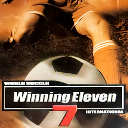

# World Soccer Winning Eleven 7: International

## PS2 Saves - SLUS20863

| Icon | Filename | Description |
|------|----------|-------------|
|  | [00000001.zip](00000001.zip){: .btn .btn-purple } | BASLUS-20863WE7IOPT: P.E.Soccer3 OPTIONFILE (2697_P_E_Soccer_344403.max) |
|  | [00000002.zip](00000002.zip){: .btn .btn-purple } | BASLUS-20863WE7I000: WS WE7 INT (3202_Winning_El_665813.max) |
|  | [00000003.zip](00000003.zip){: .btn .btn-purple } | BASLUS-20863WE7IOPT: Winning Eleven 7 OPTIONFILE (1_Winning_El_918606.max) |
|  | [00000004.zip](00000004.zip){: .btn .btn-purple } | BASLUS-20863WE7I030: WS WE7 INT (3202_WE7_replay_630596.max) |
|  | [00000005.zip](00000005.zip){: .btn .btn-purple } | BASLUS-20863WE7I020: WS WE7 INT (3202_WE7_replay_101208.max) |
