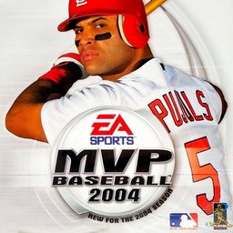

# MVP Baseball 2004

## PS2 Saves - SLUS20868

| Icon | Filename | Description |
|------|----------|-------------|
|  | [00000001.zip](00000001.zip){: .btn .btn-purple } | BASLUS-20868R3980ad1: ANew Jan 16 Rosters (1_ANew_Jan_1_670223.max) |
|  | [00000002.zip](00000002.zip){: .btn .btn-purple } | BASLUS-20868R659be98: MVP 2004 Rost1 (1576_MVP_2004_R_427716.max) |
|  | [00000003.zip](00000003.zip){: .btn .btn-purple } | BASLUS-20868R659be98: MVP 2004 Rost1 (1_MVP_2004_R_204770.max) |
|  | [00000004.zip](00000004.zip){: .btn .btn-purple } | BASLUS-20868R29acb17: MVP 2004 jan9 (1_MVP_2004_j_473782.max) |
|  | [00000005.zip](00000005.zip){: .btn .btn-purple } | BASLUS-20868Rd5a0113: MVP 2004 gforcetotalmnrs (2140_MVP_2004_g_674419.max) |
|  | [00000006.zip](00000006.zip){: .btn .btn-purple } | BASLUS-20868R2c56ac0: MVP 2004 OnlineRosters05 (2568_MVP_2004_O_464611.max) |
|  | [00000007.zip](00000007.zip){: .btn .btn-purple } | BASLUS-20868Rd5a0113: MVP 2004 gforcetotalmnrs (2398_MVP_2004_g_233151.max) |
|  | [00000008.zip](00000008.zip){: .btn .btn-purple } | BASLUS-20868R3980ad1: ANew Jan 16 Rosters (1_ANew_Jan_1_26059.max) |
|  | [00000009.zip](00000009.zip){: .btn .btn-purple } | BASLUS-20868R5df639f: GeekRostersTradedeadlinerosters (1_GeekRoster_578457.max) |
|  | [00000010.zip](00000010.zip){: .btn .btn-purple } | BASLUS-20868R659be98: MVP 2004 Rost1 (1_MVP_2004_R_797359.max) |
|  | [00000011.zip](00000011.zip){: .btn .btn-purple } | BASLUS-20868Re79b964: MVP 2004 TotalMinorsV3 (2359_MVP_2004_T_504559.max) |
|  | [00000012.zip](00000012.zip){: .btn .btn-purple } | BASLUS-20868Rff6c343: MVP 2004 t4plus (3029_MVP_2004_t_848308.max) |
|  | [00000013.zip](00000013.zip){: .btn .btn-purple } | BASLUS-20868R3980ad1: New MVP 2004 jan16 (1_New_MVP_20_909023.max) |
|  | [00000014.zip](00000014.zip){: .btn .btn-purple } | BASLUS-20868R6217c06: jonathandevinerostersbestintheg (1_jonathande_993282.max) |
|  | [00000015.zip](00000015.zip){: .btn .btn-purple } | BASLUS-20868R659be98: MVP 2004 Rost1 (1_MVP_2004_R_307660.max) |
|  | [00000016.zip](00000016.zip){: .btn .btn-purple } | BASLUS-20868Re79b964: MVP 2004 TotalMinorsV3 (2140_MVP_2004_T_544445.max) |
|  | [00000017.zip](00000017.zip){: .btn .btn-purple } | BASLUS-20868R5df639f: MVP 2004 Rost1g (2359_MVP_2004_6_881283.max) |
|  | [00000018.zip](00000018.zip){: .btn .btn-purple } | BASLUS-20868R628a4bb: MVP 2004 ROSTERUPDATE1 (1_MVP_2004_R_473385.max) |
|  | [00000019.zip](00000019.zip){: .btn .btn-purple } | BASLUS-20868R8f88c3a: MVP 2004 GOMERPYLE206 (1_MVP_2004_G_227154.max) |
