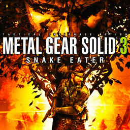

# Metal Gear Solid 3: Snake Eater

## PS2 Saves - SLUS20915

| Icon | Filename | Description |
|------|----------|-------------|
|  | [00000001.zip](00000001.zip){: .btn .btn-purple } | BASLUS-209151G000002: MGS3 GAME DATA002 (1_MGS3_GAME__24670.max) |
|  | [00000002.zip](00000002.zip){: .btn .btn-purple } | BASLUS-209151A000000: MGS3  (1_MGS3__935711.max) |
|  | [00000003.zip](00000003.zip){: .btn .btn-purple } | BASLUS-209151G000007: MGS3 GAME DATA007 (1_MGS3_GAME__349102.max) |
|  | [00000004.zip](00000004.zip){: .btn .btn-purple } | BASLUS-209151G000001: MGS3 GAME DATA002 (1_MGS3_GAME__452236.max) |
|  | [00000005.zip](00000005.zip){: .btn .btn-purple } | BASLUS-209151A000000: MGS3  (1_MGS3__537823.max) |
|  | [00000006.zip](00000006.zip){: .btn .btn-purple } | BASLUS-209151A000000: MGS3  (1_MGS3__71347.max) |
|  | [00000007.zip](00000007.zip){: .btn .btn-purple } | BASLUS-209151G000003: MGS3 GAME DATA003 (1_MGS3_GAME__32590.max) |
|  | [00000008.zip](00000008.zip){: .btn .btn-purple } | BASLUS-209151G000001: MGS3 GAME DATA001 (1_MGS3_GAME__905956.max) |
|  | [00000009.zip](00000009.zip){: .btn .btn-purple } | BASLUS-209151G000002: MGS3 GAME DATA002 (1_MGS3_GAME__356671.max) |
|  | [00000010.zip](00000010.zip){: .btn .btn-purple } | BASLUS-209151A000000: MGS3  (1_MGS3__102383.max) |
