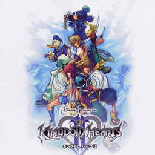

# Kingdom Hearts II

## PS2 Saves - SLUS21005

| Icon | Filename | Description |
|------|----------|-------------|
|  | [00000001.zip](00000001.zip){: .btn .btn-purple } | BASLUS-21005-06: KINGDOMHEARTS II[07]LV18/  5:38 (9080_KINGDOMHEA_255444.max) |
|  | [00000002.zip](00000002.zip){: .btn .btn-purple } | BASLUS-21005-07: KINGDOMHEARTS II[08]LV23/  9:41 (9080_KINGDOMHEA_508724.max) |
|  | [00000003.zip](00000003.zip){: .btn .btn-purple } | BASLUS-21005-08: KINGDOMHEARTS II[09]LV23/ 10:23 (9080_KINGDOMHEA_701168.max) |
|  | [00000004.zip](00000004.zip){: .btn .btn-purple } | BASLUS-21005-04: KINGDOMHEARTS II[05]LV12/  2:23 (9080_KINGDOMHEA_843960.max) |
|  | [00000005.zip](00000005.zip){: .btn .btn-purple } | BASLUS-21005-02: KINGDOMHEARTS II[03]LV12/  1:39 (9080_KINGDOMHEA_411663.max) |
|  | [00000006.zip](00000006.zip){: .btn .btn-purple } | BASLUS-21005-00: KINGDOMHEARTS II[01]LV99/396:37 (9080_KINGDOMHEA_307598.max) |
|  | [00000007.zip](00000007.zip){: .btn .btn-purple } | BASLUS-21005-00: KINGDOMHEARTS II[01]LV99/309:24 (9080_KINGDOMHEA_950573.max) |
|  | [00000008.zip](00000008.zip){: .btn .btn-purple } | BASLUS-21005-00: KINGDOMHEARTS II[01]LV99/296:52 (9080_KINGDOMHEA_906215.max) |
|  | [00000009.zip](00000009.zip){: .btn .btn-purple } | BASLUS-21005-05: KINGDOMHEARTS II[06]LV12/  2:27 (9080_KINGDOMHEA_437130.max) |
|  | [00000010.zip](00000010.zip){: .btn .btn-purple } | BASLUS-21005-03: KINGDOMHEARTS II[04]LV12/  2:20 (9080_KINGDOMHEA_515194.max) |
