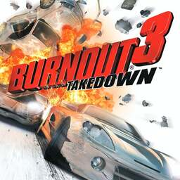

# Burnout 3: Takedown

## PS2 Saves - SLUS21050

| Icon | Filename | Description |
|------|----------|-------------|
|  | [00000001.zip](00000001.zip){: .btn .btn-purple } | BASLUS-21050: Burnout 3 (3894_Burnout_3_468975.max) |
|  | [00000002.zip](00000002.zip){: .btn .btn-purple } | BASLUS-21050: Burnout 3 (3412_Burnout_3__677624.max) |
|  | [00000003.zip](00000003.zip){: .btn .btn-purple } | BASLUS-21050: Burnout 3 (3320_Burnout_3_462475.max) |
|  | [00000004.zip](00000004.zip){: .btn .btn-purple } | BASLUS-21050: Burnout 3 (3254_Burnout_3_634106.max) |
|  | [00000005.zip](00000005.zip){: .btn .btn-purple } | BASLUS-21050: Burnout 3 (2263_Burnout_3_402401.max) |
|  | [00000006.zip](00000006.zip){: .btn .btn-purple } | BASLUS-21050: Burnout 3 (4282_Burnout_3_919933.max) |
|  | [00000007.zip](00000007.zip){: .btn .btn-purple } | BASLUS-21050: Burnout 3 (3490_Burnout_3_910442.max) |
|  | [00000008.zip](00000008.zip){: .btn .btn-purple } | BASLUS-21050: Burnout 3 (4173_Burnout_3_422238.max) |
