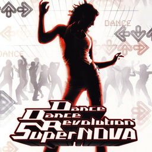

# Dance Dance Revolution SuperNova

## PS2 Saves - SLUS21377

| Icon | Filename | Description |
|------|----------|-------------|
|  | [00000001.zip](00000001.zip){: .btn .btn-purple } | BASLUS-21377system: DDR SuperNOVA  SYSTEM (19444_DDR_SuperN_770077.max) |
|  | [00000002.zip](00000002.zip){: .btn .btn-purple } | BASLUS-21377system: DDR SuperNOVA SYSTEM (18365_DDR_SuperN_437390.max) |
|  | [00000003.zip](00000003.zip){: .btn .btn-purple } | BASLUS-21377system: DDR SuperNOVA SYSTEM (16372_DDR_SuperN_676846.max) |
|  | [00000004.zip](00000004.zip){: .btn .btn-purple } | BASLUS-21377system: DDR SuperNOVA SYSTEM (8240_DDR_SuperN_456173.max) |
|  | [00000005.zip](00000005.zip){: .btn .btn-purple } | BASLUS-21377system: DDR SuperNOVA  SYSTEM (1_DDR_SuperN_466290.max) |
|  | [00000006.zip](00000006.zip){: .btn .btn-purple } | BASLUS-21377system: DDR SuperNOVA  SYSTEM (1_DDR_SuperN_926204.max) |
|  | [00000007.zip](00000007.zip){: .btn .btn-purple } | BASLUS-21377system: DDR SuperNOVA SYSTEM (21789_DDR_SuperN_795009.max) |
