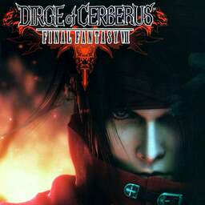

# Dirge of Cerberus: Final Fantasy VII

## PS2 Saves - SLUS21419

| Icon | Filename | Description |
|------|----------|-------------|
|  | [00000001.zip](00000001.zip){: .btn .btn-purple } | BASLUS-21419000: DC -FFVII- (1_DC__FFVII__776195.max) |
|  | [00000002.zip](00000002.zip){: .btn .btn-purple } | BASLUS-21419000: DC -FFVII- (21532_DC__FFVII__381069.max) |
|  | [00000003.zip](00000003.zip){: .btn .btn-purple } | BASLUS-21419000: DC -FFVII- (20022_DC__FFVII__391766.max) |
|  | [00000004.zip](00000004.zip){: .btn .btn-purple } | BASLUS-21419000: DC -FFVII- (19485_DC__FFVII__961284.max) |
|  | [00000005.zip](00000005.zip){: .btn .btn-purple } | BASLUS-21419000: DC -FFVII- (1392_DC__FFVII__591457.max) |
|  | [00000006.zip](00000006.zip){: .btn .btn-purple } | BASLUS-21419000: DC -FFVII- (1_DC__FFVII__731869.max) |
|  | [00000007.zip](00000007.zip){: .btn .btn-purple } | BASLUS-21419000: DC -FFVII- (18198_DC__FFVII__601589.max) |
|  | [00000008.zip](00000008.zip){: .btn .btn-purple } | BASLUS-21419000: DC -FFVII- (19742_DC__FFVII__677105.max) |
|  | [00000009.zip](00000009.zip){: .btn .btn-purple } | BASLUS-21419000: DC -FFVII- (6195_DC__FFVII__918606.max) |
