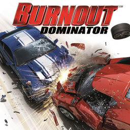

# Burnout Dominator

## PS2 Saves - SLUS21596

| Icon | Filename | Description |
|------|----------|-------------|
|  | [00000001.zip](00000001.zip){: .btn .btn-purple } | BASLUS-21596-BD: Burnout Dominator (23225_Burnout_Do_522671.max) |
|  | [00000002.zip](00000002.zip){: .btn .btn-purple } | BASLUS-21596-BD: Burnout Dominator (22989_Burnout_Do_886349.max) |
|  | [00000003.zip](00000003.zip){: .btn .btn-purple } | BASLUS-21596-BD: Burnout Dominator (25826_Burnout_Do_934780.max) |
|  | [00000004.zip](00000004.zip){: .btn .btn-purple } | BASLUS-21596-BD: Burnout Dominator (24209_Burnout_Do_202054.max) |
|  | [00000005.zip](00000005.zip){: .btn .btn-purple } | BASLUS-21596-BD: Burnout Dominator (23450_Burnout_Do_254681.max) |
|  | [00000006.zip](00000006.zip){: .btn .btn-purple } | BASLUS-21596-BD: Burnout Dominator (20813_Burnout_Do_144253.max) |
|  | [00000007.zip](00000007.zip){: .btn .btn-purple } | BASLUS-21596-BD: Burnout Dominator (21391_Burnout_Do_876827.max) |
