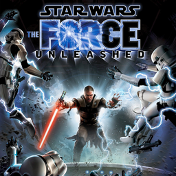

# Star Wars: The Force Unleashed

## PS2 Saves - SLUS21614

| Icon | Filename | Description |
|------|----------|-------------|
|  | [00000001.zip](00000001.zip){: .btn .btn-purple } | BASLUS-21614SW07: Star Wars: TheForce Unleashed (25899_Star_Wars__483212.max) |
|  | [00000002.zip](00000002.zip){: .btn .btn-purple } | BASLUS-21614SW07: Star Wars: TheForce Unleashed (1_Star_Wars__798702.max) |
|  | [00000003.zip](00000003.zip){: .btn .btn-purple } | BASLUS-21614SW07: Star Wars: TheForce Unleashed (24917_Star_Wars__758953.max) |
|  | [00000004.zip](00000004.zip){: .btn .btn-purple } | BASLUS-21614SW07: Star Wars: TheForce Unleashed (25207_Star_Wars__97607.max) |
|  | [00000005.zip](00000005.zip){: .btn .btn-purple } | BASLUS-21614SW07: Star Wars: TheForce Unleashed (25403_Star_Wars__11731.max) |
|  | [00000006.zip](00000006.zip){: .btn .btn-purple } | BASLUS-21614SW07: Star Wars: TheForce Unleashed (17791_Star_Wars__949474.max) |
