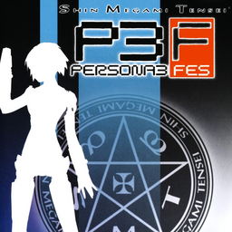

# Shin Megami Tensei: Persona 3 FES

## PS2 Saves - SLUS21621

| Icon | Filename | Description |
|------|----------|-------------|
|  | [00000001.zip](00000001.zip){: .btn .btn-purple } | Finished save from the undub version |
|  | [00000011.zip](00000011.zip){: .btn .btn-purple } | BASLUS-21621Save0:   P3FES- JOURNEY(1) (24941_P3FES__JOU_960216.max) |
|  | [00000002.zip](00000002.zip){: .btn .btn-purple } | BASLUS-21621Save14:   P3FES- JOURNEY(15) (21356_P3FES__JOU_474362.max) |
|  | [00000003.zip](00000003.zip){: .btn .btn-purple } | BASLUS-21621Save1:   P3FES- JOURNEY(2) (24442_P3FES__JOU_685101.max) |
