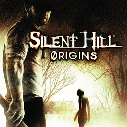

# Silent Hill Origins

## PS2 Saves - SLUS21731

| Icon | Filename | Description |
|------|----------|-------------|
|  | [00000001.zip](00000001.zip){: .btn .btn-purple } | BASLUS-2173110: Silent Hill Origins 10 (25406_Silent_Hil_482937.max) |
|  | [00000002.zip](00000002.zip){: .btn .btn-purple } | BASLUS-217311: Silent Hill Origins 1 (26296_Silent_Hil_49283.max) |
|  | [00000003.zip](00000003.zip){: .btn .btn-purple } | BASLUS-217312: Silent Hill Origins 2 (25837_Silent_Hil_208569.max) |
|  | [00000004.zip](00000004.zip){: .btn .btn-purple } | BASLUS-217311: Silent Hill Origins 1 (24980_Silent_Hil_587460.max) |
|  | [00000005.zip](00000005.zip){: .btn .btn-purple } | BASLUS-217312: Silent Hill Origins 2 (26173_Silent_Hil_750332.max) |
|  | [00000006.zip](00000006.zip){: .btn .btn-purple } | BASLUS-217314: Silent Hill Origins 4 (24683_Silent_Hil_255246.max) |
|  | [00000007.zip](00000007.zip){: .btn .btn-purple } | BASLUS-217312: Silent Hill Origins 2 (25837_Silent_Hil_405804.max) |
|  | [00000008.zip](00000008.zip){: .btn .btn-purple } | BASLUS-217315: Silent Hill Origins 5 (23947_make_it_be_314511.max) |
|  | [00000009.zip](00000009.zip){: .btn .btn-purple } | BASLUS-217311: Silent Hill Origins 1 (27125_Silent_Hil_58942.max) |
