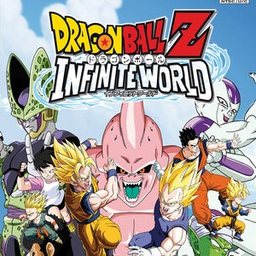

# Dragon Ball Z: Infinite World

## PS2 Saves - SLUS21842

| Icon | Filename | Description |
|------|----------|-------------|
|  | [00000001.zip](00000001.zip){: .btn .btn-purple } | BASLUS-21842DBZIW: DRAGONBALLZINFINITE WORLD (25406_DRAGONBALL_321499.max) |
|  | [00000002.zip](00000002.zip){: .btn .btn-purple } | BASLUS-21842DBZIW: DRAGONBALLZINFINITE WORLD (25456_DRAGONBALL_178250.max) |
|  | [00000003.zip](00000003.zip){: .btn .btn-purple } | BASLUS-21842DBZIW: DRAGONBALLZINFINITE WORLD (25406_DRAGONBALL_436047.max) |
|  | [00000004.zip](00000004.zip){: .btn .btn-purple } | BASLUS-21842DBZIW: DRAGONBALLZINFINITE WORLD (24418_Dragon_Bal_616833.max) |
|  | [00000005.zip](00000005.zip){: .btn .btn-purple } | BASLUS-21842DBZIW: DRAGONBALLZINFINITE WORLD (26860_DRAGONBALL_895016.max) |
|  | [00000006.zip](00000006.zip){: .btn .btn-purple } | BASLUS-21842DBZIW: DRAGONBALLZINFINITE WORLD (26455_DRAGONBALL_197201.max) |
