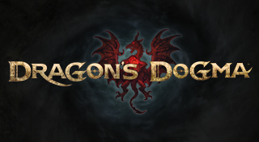

# Dragons Dogma

## PS3 Saves - BLUS30720

| Icon | Filename | Description |
|------|----------|-------------|
|  | [00230013.zip](00230013.zip){: .btn .btn-purple } | Fighter/Mage - NG+ - LV 1 with legit stats - All Vocations & Abilities - Max DP - Main Pawn has all Knowledge - 2 copies of each ultimate equipment Dragonforged - Various cosmetic gear (Fur cloaks, thongs, chainmail bikinis) - All 10 Portcrystals |
|  | [00230301.zip](00230301.zip){: .btn .btn-purple } | Fighter/Strider - NG+ - LV 1 with legit stats - All Vocations & Abilities - Max DP - Main Pawn has all Knowledge - 2 copies of each ultimate equipment Dragonforged - Various cosmetic gear (Fur cloaks, thongs, chainmail bikinis) - All 10 Portcrysta |
|  | [00230524.zip](00230524.zip){: .btn .btn-purple } | Fighter/Fighter - NG+ - LV 1 with legit stats - All Vocations & Abilities - Max DP - Main Pawn has all Knowledge - 2 copies of each ultimate equipment Dragonforged - Various cosmetic gear (Fur cloaks, thongs, chainmail bikinis) - All 10 Portcrysta |
|  | [00230734.zip](00230734.zip){: .btn .btn-purple } | Mage/Fighter - NG+ - LV 1 with legit stats - All Vocations & Abilities - Max DP - Main Pawn has all Knowledge - 2 copies of each ultimate equipment Dragonforged - Various cosmetic gear (Fur cloaks, thongs, chainmail bikinis) - All 10 Portcrystals |
|  | [00230923.zip](00230923.zip){: .btn .btn-purple } | Mage/Strider - NG+ - LV 1 with legit stats - All Vocations & Abilities - Max DP - Main Pawn has all Knowledge - 2 copies of each ultimate equipment Dragonforged - Various cosmetic gear (Fur cloaks, thongs, chainmail bikinis) - All 10 Portcrystals |
|  | [00231350.zip](00231350.zip){: .btn .btn-purple } | Mage/Mage - NG+ - LV 1 with legit stats - All Vocations & Abilities - Max DP - Main Pawn has all Knowledge - 2 copies of each ultimate equipment Dragonforged - Various cosmetic gear (Fur cloaks, thongs, chainmail bikinis) - All 10 Portcrystals |
|  | [00231740.zip](00231740.zip){: .btn .btn-purple } | Strider/Fighter - NG+ - LV 1 with legit stats - All Vocations & Abilities - Max DP - Main Pawn has all Knowledge - 2 copies of each ultimate equipment Dragonforged - Various cosmetic gear (Fur cloaks, thongs, chainmail bikinis) - All 10 Portcrysta |
|  | [00232025.zip](00232025.zip){: .btn .btn-purple } | Strider/Mage - NG+ - LV 1 with legit stats - All Vocations & Abilities - Max DP - Main Pawn has all Knowledge - 2 copies of each ultimate equipment Dragonforged - Various cosmetic gear (Fur cloaks, thongs, chainmail bikinis) - All 10 Portcrystals |
|  | [00232158.zip](00232158.zip){: .btn .btn-purple } | Strider/Strider - NG+ - LV 1 with legit stats - All Vocations & Abilities - Max DP - Main Pawn has all Knowledge - 2 copies of each ultimate equipment Dragonforged - Various cosmetic gear (Fur cloaks, thongs, chainmail bikinis) - All 10 Portcrysta |
