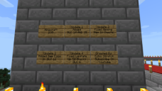

# Minecraft

## PS4 Saves - CUSA00265

| Icon | Filename | Description |
|------|----------|-------------|
|  | [00000001.zip](00000001.zip){: .btn .btn-purple } | Trophy World 1.0 By Echo Stretch (2.35) |
|  | [00000002.zip](00000002.zip){: .btn .btn-purple } | Trophy World 2.4 By Echo Stretch (2.66) |
|  | [00000003.zip](00000003.zip){: .btn .btn-purple } | Minigame Lobby (Legacy) |
|  | [00000004.zip](00000004.zip){: .btn .btn-purple } | Minigame Lobby - World Data (Legacy) |
|  | [00000005.zip](00000005.zip){: .btn .btn-purple } | Tutorial 1.00 (Legacy) |
|  | [00000006.zip](00000006.zip){: .btn .btn-purple } | Tutorial 1.00 - World Data (Legacy) |
|  | [00000007.zip](00000007.zip){: .btn .btn-purple } | Tutorial 1.75 (Legacy) |
|  | [00000008.zip](00000008.zip){: .btn .btn-purple } | Tutorial 1.75 - World Data (Legacy) |
|  | [00000009.zip](00000009.zip){: .btn .btn-purple } | Tutorial 1.95 (Legacy) |
|  | [00000010.zip](00000010.zip){: .btn .btn-purple } | Tutorial 1.95 - World Data (Legacy) |
|  | [00000011.zip](00000011.zip){: .btn .btn-purple } | Tutorial 1.95 - World Data 2 (Legacy) |
