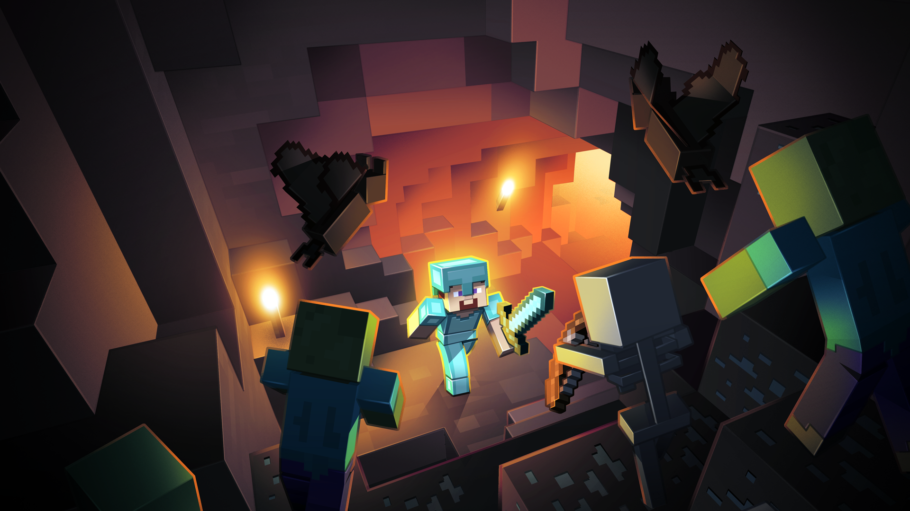

# Minecraft

## PS4 Saves - CUSA00265

| Icon | Filename | Description |
|------|----------|-------------|
|  | [00000001.zip](00000001.zip){: .btn .btn-purple } | Trophy World 1.0 By Echo Stretch (2.35) |
|  | [00000002.zip](00000002.zip){: .btn .btn-purple } | Trophy World 2.4 By Echo Stretch (2.66) |
|  | [00000003.zip](00000003.zip){: .btn .btn-purple } | Minigame Lobby |
|  | [00000004.zip](00000004.zip){: .btn .btn-purple } | Tutorial 1.00 (TU14) |
|  | [00000005.zip](00000005.zip){: .btn .btn-purple } | Tutorial 1.75 (TU46) |
|  | [00000006.zip](00000006.zip){: .btn .btn-purple } | Tutorial 1.95 (TU69) |
|  | [00000007.zip](00000007.zip){: .btn .btn-purple } | Barrier item |
|  | [00000008.zip](00000008.zip){: .btn .btn-purple } | Minigame Lobby Old |
|  | [00000009.zip](00000009.zip){: .btn .btn-purple } | Tutorial 1.16 (TU19) |
|  | [00000010.zip](00000010.zip){: .btn .btn-purple } | Tutorial 1.25 (TU31) |
|  | [00000011.zip](00000011.zip){: .btn .btn-purple } | All items (Trophies) |
|  | [00000012.zip](00000012.zip){: .btn .btn-purple } | Unobtainables |
|  | [00000013.zip](00000013.zip){: .btn .btn-purple } | Unobtainables (Flat) |
|  | [00000014.zip](00000014.zip){: .btn .btn-purple } | Tutorial Pre-TU1 |
|  | [00000015.zip](00000015.zip){: .btn .btn-purple } | Tutorial TU1 |
|  | [00000016.zip](00000016.zip){: .btn .btn-purple } | Tutorial TU3 |
|  | [00000017.zip](00000017.zip){: .btn .btn-purple } | Tutorial TU5 |
|  | [00000018.zip](00000018.zip){: .btn .btn-purple } | Tutorial TU7 |
|  | [00000019.zip](00000019.zip){: .btn .btn-purple } | Tutorial TU9 |
|  | [00000020.zip](00000020.zip){: .btn .btn-purple } | Tutorial TU12 |
