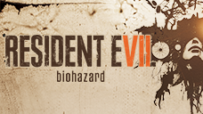

# Resident Evil 7 Biohazard Gold Edition

## PS4 Saves - CUSA03962

| Icon | Filename | Description |
|------|----------|-------------|
|  | [00000001.zip](00000001.zip){: .btn .btn-purple } | Complete in madhouse mode. Infinite ammo unlocked |
|  | [00000002.zip](00000002.zip){: .btn .btn-purple } | (End of Zoe) Completed in Joe Must Die mode. All challenges, All weapons and infinite ammunition obtained. |
|  | [00000003.zip](00000003.zip){: .btn .btn-purple } | (Not A Hero) Complete in Professional mode. Infinite ammo unlocked |
|  | [00000006.zip](00000006.zip){: .btn .btn-purple } | (Banned Footage Vol. 1 DLC) Completed: -Nightmare Mode on -Night Terror difficulty -The Bedroom -Ethan Must Die |
|  | [00000008.zip](00000008.zip){: .btn .btn-purple } | (Banned Footage Vol. 2 DLC) Completed: -Mode 21 in Survivor + -Daughters with both endings -55th Birthday of JACK with Rank S |
