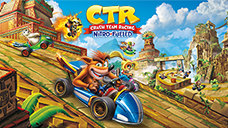

# Crash™ Team Racing Nitro-Fueled

## PS4 Saves - CUSA13795

| Icon | Filename | Description |
|------|----------|-------------|
|  | [00000001.zip](00000001.zip){: .btn .btn-purple } | Everything unlocked - Global profile save |
|  | [00000002.zip](00000002.zip){: .btn .btn-purple } | Everything unlocked 101% done - classic |
|  | [00000003.zip](00000003.zip){: .btn .btn-purple } | Everything unlocked 101% done - nitro fueled (easy) |
|  | [00000004.zip](00000004.zip){: .btn .btn-purple } | Everything unlocked 101% done - nitro fueled (normal) |
|  | [00000005.zip](00000005.zip){: .btn .btn-purple } | Everything unlocked 101% done - nitro fueled (hard) |
