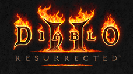

# Diablo® II: Resurrected™

## PS4 Saves - CUSA18937

| Icon | Filename | Description |
|------|----------|-------------|
|  | [00000001.zip](00000001.zip){: .btn .btn-purple } | Storage-Druid-runes/gems/modified items |
|  | [00000002.zip](00000002.zip){: .btn .btn-purple } | kk-Sorceress-All char's are around lvl 80 with end game gear |
|  | [00000003.zip](00000003.zip){: .btn .btn-purple } | datboi-Barbarian-All char's were modified by FalsePhilosopher |
|  | [00000004.zip](00000004.zip){: .btn .btn-purple } | Boots-Paladin-Except Fisty who was modified by Fukk_U |
|  | [00000005.zip](00000005.zip){: .btn .btn-purple } | assassassin-Assassin-Big ups to "JeffVanGorp"'s Hero-Editor-Assets github repo for the modded items/chars |
|  | [00000006.zip](00000006.zip){: .btn .btn-purple } | long-bone-Necromancer-Big ups to d2runewizard's hero-editor |
|  | [00000007.zip](00000007.zip){: .btn .btn-purple } | eattherich-Amazon-Big ups to bucanero for everything they do for the ps scene |
|  | [00000008.zip](00000008.zip){: .btn .btn-purple } | Cheater-Fisty-Heavily modified char, epilepsy warning this char moves like sanic on crack fast! |
