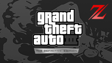

# Grand Theft Auto III - The Definitive Edition

## PS4 Saves - CUSA26613

| Icon | Filename | Description |
|------|----------|-------------|
|  | [00000001.zip](00000001.zip){: .btn .btn-purple } | [v1.04] Z-100% Save: (Inf Health), All Collectionables, Story Mode (100%), Max Money, All Weapons with Infinite Ammo, [All Garages] Banshee Mod. |
|  | [00000002.zip](00000002.zip){: .btn .btn-purple } | [v1.04] Z-100% Save: (No Inf Health), All Collectionables, Story Mode (100%), Max Money, All Weapons with Infinite Ammo, [All Garages] Banshee Mod. |
|  | [00000003.zip](00000003.zip){: .btn .btn-purple } | [v1.04] Z-Starter Save: Max Money, [Initial Garage] Mafia Sentinel Mod. |
|  | [00000004.zip](00000004.zip){: .btn .btn-purple } | [v1.04] Z-Starter Save: All Weapons (Infinite Ammo), [Initial Garage] Banshee Mod. |
|  | [00000005.zip](00000005.zip){: .btn .btn-purple } | [v1.04] (Optional) Settings |