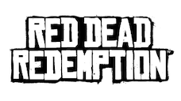

# Red Dead Redemption

## PS4 Saves - CUSA36842

| Icon | Filename | Description |
|------|----------|-------------|
|  | [00000001.zip](00000001.zip){: .btn .btn-purple } | [v1.03] Save 100%: Max Money & Inventory, All Weapons, All Safehouses, All Outfits, All Horses Unlocked, All Missions Gold, etc |
|  | [00000002.zip](00000002.zip){: .btn .btn-purple } | [v1.03] [Starter Save]: Max Money, 90% Outfits Unlocked, All Weapons With Max Ammo, All Horses Unlocked & Full Inventory |
|  | [00000003.zip](00000003.zip){: .btn .btn-purple } | [v1.03] [Starter Save]: Max Money Only |
|  | [00000004.zip](00000004.zip){: .btn .btn-purple } | [v1.03] Undead Nightmare completed with 100% with John Marston Skin Mod, All Weapons & Horses Unlocked |
|  | [00000005.zip](00000005.zip){: .btn .btn-purple } | [v1.03] [Starter Save]: John Marston Zombie Mod(Can you alternate Human/Zombie), All Weapons, All Horses Unlocked, etc |
|  | [00000006.zip](00000006.zip){: .btn .btn-purple } | [v1.03] [Starter Save]: John Marston Zombie Modded Only |
|  | [00000007.zip](00000007.zip){: .btn .btn-purple } | [v1.03] Settings: All Cheats Unlocked & Gold Weapons Enabled |
