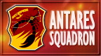

# Ace Combat: Joint Assault

## PSP Saves - NPJH50263

| Icon | Filename | Description |
|------|----------|-------------|
|  | [00000251.zip](00000251.zip){: .btn .btn-purple } | Complete game except S Rank |
|  | [00000252.zip](00000252.zip){: .btn .btn-purple } | New Game with max credit. Youn can buy any planes. |
|  | [00000253.zip](00000253.zip){: .btn .btn-purple } | All Planes/Parts/Emblems Unlocked |
|  | [00000254.zip](00000254.zip){: .btn .btn-purple } | Has every plane unlocked including varcolac, Almost all parts, and a lot of emblems. Didn't hack. |
|  | [00000255.zip](00000255.zip){: .btn .btn-purple } | 100% story mode completed,all planes unlocked in the hangar, selected planes bought. I dont Hack this save data |
|  | [00000256.zip](00000256.zip){: .btn .btn-purple } | 100% completion of Offline Mod |
