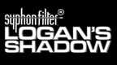

# Syphon Filter: Logan's Shadow

## PSP Saves - UCUS98606

| Icon | Filename | Description |
|------|----------|-------------|
|  | [00000827.zip](00000827.zip){: .btn .btn-purple } | Game done on normal mode Found all Hidden evidence in main levels Some of the weapons unlocked |
|  | [00000828.zip](00000828.zip){: .btn .btn-purple } | All 5 training missions complete. |
|  | [00000829.zip](00000829.zip){: .btn .btn-purple } | All Career Ratings Unlocked + Bonus Missions. Most Hidden Evidence found. |
|  | [00000830.zip](00000830.zip){: .btn .btn-purple } | All hidden evidence found in single player levels as well as bonus missions.all locked files unlocked ,most weapons at level 4 except 3 are at low to mid 80 |
