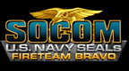

# SOCOM: U.S. Navy SEALs Fireteam Bravo

## PSP Saves - UCUS98615

| Icon | Filename | Description |
|------|----------|-------------|
|  | [00001000.zip](00001000.zip){: .btn .btn-purple } | Finished the campaign Ensign, Commander and Admiral. Some unlockables are unlocked. |
|  | [00001001.zip](00001001.zip){: .btn .btn-purple } | Brand new game. |
|  | [00001003.zip](00001003.zip){: .btn .btn-purple } | Completed on Commander. All PSP cross talk objectives complete. Most of Socom 3 cross talk material transfered. |
|  | [00001004.zip](00001004.zip){: .btn .btn-purple } | All main missions complete |
|  | [00001005.zip](00001005.zip){: .btn .btn-purple } | Game beat on Ensign: unlocks STG-77, IW-80, Front Grip, Medium Scope, and 3 multiplayer Skins (only unlockable with psp) on Socom 3. |
|  | [00001006.zip](00001006.zip){: .btn .btn-purple } | Elite Seal Unlocked 100% |
|  | [00001007.zip](00001007.zip){: .btn .btn-purple } | 100% finished |
|  | [00001008.zip](00001008.zip){: .btn .btn-purple } | All instant action missions and campaign missions beat on ensign, commander, and admiral. All characters and weapons unlocked. All cross talk objectives complete. |
|  | [00001002.zip](00001002.zip){: .btn .btn-purple } | Single Player Completed. 23 out of 25 cross-talk objective completed |
