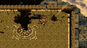

# Legacy of Ys: Books I & II

## PSP Saves - ULJM05474

| Icon | Filename | Description |
|------|----------|-------------|
|  | [00000210.zip](00000210.zip){: .btn .btn-purple } | Ys 1 Ending Easy Mode Final Boss Beaten |
|  | [00000211.zip](00000211.zip){: .btn .btn-purple } | Ys I & II Chronicles - Ys II LVL94 - Nightmare - Start Of Game |
|  | [00000212.zip](00000212.zip){: .btn .btn-purple } | Ys I & II Chronicles - Ys I LVL10 - Nightmare - Start Of Game |
|  | [00000213.zip](00000213.zip){: .btn .btn-purple } | Ys I - Easy difficulty, Lvl. 9, start of Darm Tower |
|  | [00000214.zip](00000214.zip){: .btn .btn-purple } | Ys I - Easy difficulty, Lvl. 9, before final boss |
|  | [00000215.zip](00000215.zip){: .btn .btn-purple } | Save game not completed, lv 42, with Samurai class A and good itens. |
|  | [00000216.zip](00000216.zip){: .btn .btn-purple } | Level 90 S class Knight 3 level 89+ S class companions. A and S class gear on all. Main story I believe completed final dungeon unlocked but not started. |
|  | [00000217.zip](00000217.zip){: .btn .btn-purple } | Level 36 Izark(Samurai (Unlocked) Grade 4 Adventurer |
|  | [00000218.zip](00000218.zip){: .btn .btn-purple } | EU version 10 Fool cards |
|  | [00000219.zip](00000219.zip){: .btn .btn-purple } | Save at at Kasugayama High with 10 fool cards and all personae up to level 13 |
|  | [00000220.zip](00000220.zip){: .btn .btn-purple } | 3 Save files: First is post game, Second is before major boss battle, Third is before final boss. Level 79 Tatsuya, Level 99 Party, Top Tier Equipment, Satan and Lucifer. No cheats or hacks. |
|  | [00000221.zip](00000221.zip){: .btn .btn-purple } | 2 Save files, first one is after defeating the final boss, and the second one is only a save file to complete the gallery. |
|  | [00000222.zip](00000222.zip){: .btn .btn-purple } | Total level 119584 NG+ all giga darkdeath evilman parts obtained. Asagi Costume on. 14 playthroughs. |
|  | [00000223.zip](00000223.zip){: .btn .btn-purple } | tolal lv. 151969 Asagi costume on. 14 playthroughs. Dark Lord Valvoga defeated. |
|  | [00000224.zip](00000224.zip){: .btn .btn-purple } | First Chapter, NG+. Level 3557. SAT-based hero. Several endings complete. Most base crews maxed. First Mastery Cave complete. |
|  | [00000225.zip](00000225.zip){: .btn .btn-purple } | 126K Total Level, Darkdeath equipment, NG+, good start for post grinding |
|  | [00000226.zip](00000226.zip){: .btn .btn-purple } | Name : Mio Farm name : Meyter with Dog , Horse , 5 Cows , 6 Chickens , Green House , Sprinkler , Two Beds , and Complete all Expansions Gold : 786409 with Blue Feather and many Foods in fridge . |
|  | [00000227.zip](00000227.zip){: .btn .btn-purple } | US/ JAP version, All Rare Items, Name: Alex, Dog Name: Nall Farm Name: Lunar, have all expansions including greeenhouse and sprinkler, married alice and all villagers max hearts. 20k + money |
|  | [00000230.zip](00000230.zip){: .btn .btn-purple } | 33K Event All Complte Ready to Marry All unlock All village max herat (even girl) |
|  | [00000231.zip](00000231.zip){: .btn .btn-purple } | All event compelete All max heart ready tomarry and unlock scare land all fishing spot unlock and more |
|  | [00000232.zip](00000232.zip){: .btn .btn-purple } | 9999999G,3 chickens, 2 cows, Horse and Dog max hearts, all villagers have max heart. many food in the fridge. fall 20 Yr.1. recently finished giving gina the rainbow silk, found the underground church |
|  | [00000233.zip](00000233.zip){: .btn .btn-purple } | 9999999G,2nd Day,1st Year,Wtih 99 Ap Medicine in storage.Character name Jude.Farm name Macriss |
