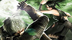

# Tenchu: Time of the Assassins

## PSP Saves - ULJS00018

| Icon | Filename | Description |
|------|----------|-------------|
|  | [00000621.zip](00000621.zip){: .btn .btn-purple } | Custom Mission "Shadows of Vengeance, Pt. 1: Corruption" - a 1player assassinate mission in the bamboo forest |
|  | [00000622.zip](00000622.zip){: .btn .btn-purple } | Punishment - This is a remake of Punish the Evil Merchant from Tenchu:Stealth Assassins. Enjoy! |
|  | [00000623.zip](00000623.zip){: .btn .btn-purple } | Custom mission - News of an invasion of a town in Godha's realm was causing a stir among the citizens of Godha. Find the truth behind this supposed invasion plot and do what is necessary to prevent it. |
|  | [00000624.zip](00000624.zip){: .btn .btn-purple } | Mission Title: JOHN WEST. Contributor: RAI-ON. Description: B-Side mission set in the City, Tileset. Inspired by the game Manhunt. Expose Starkweather's diabolical schemes involving the staff and animals in the local Zoo.(slot 14) |
|  | [00000625.zip](00000625.zip){: .btn .btn-purple } | Custom mission "Grey Fox", MGS-Tenchu crossover boss battle |
|  | [00000626.zip](00000626.zip){: .btn .btn-purple } | New Custom Mission: Shinigami no Yoru (Night of the Death Gods) |
|  | [00000627.zip](00000627.zip){: .btn .btn-purple } | All mission clear |
|  | [00000628.zip](00000628.zip){: .btn .btn-purple } | Custom mission "Revenge", backup your own missions before saving (My first custom mission) |
|  | [00000630.zip](00000630.zip){: .btn .btn-purple } | This is a demo level to display difficult jumps that can be used in the editor. The North path makes use of the bear's climbing ability, where the main path requires double-jumping and the wallkick for extra distance. Folder 03 |
|  | [00000632.zip](00000632.zip){: .btn .btn-purple } | My custom mission: "Autumn Night - A Woman's Tears" |
|  | [00000634.zip](00000634.zip){: .btn .btn-purple } | New Tenchu story I made. The story takes place after the Onikage incident. Echigoya Lee was kindnapping girls and killing them. The stage is a remix of Tenchu 1 and Tenchu 3's Punish the Evil Merchan |
