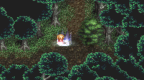

# Tales of Phantasia: Full Voice Edition

## PSP Saves - ULJS00079

| Icon | Filename | Description |
|------|----------|-------------|
|  | [00000739.zip](00000739.zip){: .btn .btn-purple } | Save 02-Origin, just before the fight with Origin in order to get the Eternal Sword. |
|  | [00000740.zip](00000740.zip){: .btn .btn-purple } | Save 01-In the past, ready to go to the present to face Dhaos. All characters are around Lv 30s |
|  | [00000742.zip](00000742.zip){: .btn .btn-purple } | Save 14-Litith, Cless ready to fight Lilith with his ultimate sword. |
|  | [00000743.zip](00000743.zip){: .btn .btn-purple } | Save 05-Dhaos Castle, Final Save Point. Some characters are almost in Lv. 60. Moria Gallery completed. |
|  | [00000745.zip](00000745.zip){: .btn .btn-purple } | Save 04-Dhaos Castle, the beginning of Dhaos Castle in the Future. |
|  | [00000746.zip](00000746.zip){: .btn .btn-purple } | Save 03-Ary, Eternal Sword forged. This is outside of Ary, just before the final scene before Dhaos. |
|  | [00000747.zip](00000747.zip){: .btn .btn-purple } | Save 00-In the future, right after Volt's Cave and just got the winpack to fly freely. |
|  | [00000748.zip](00000748.zip){: .btn .btn-purple } | Savegame right before the pegasus fight, Cless Lv.35, 208971 Gald |
|  | [00000750.zip](00000750.zip){: .btn .btn-purple } | Beginning of the game, after the first few scenes, just went out to save/have done nothing. Max money only save on save 2 |
|  | [00000751.zip](00000751.zip){: .btn .btn-purple } | Final Save point, most sidequest done. Level 60 to 70 Characters |
|  | [00000753.zip](00000753.zip){: .btn .btn-purple } | Save 16-Pluto fight, characters are ready to fight Pluto in Moria Gallery. |
|  | [00000757.zip](00000757.zip){: .btn .btn-purple } | Save 06-New File with 55,000+ Grade Points, enough to buy out the whole shop. Most of Cless skills master, over 1.9 Gald can be ratain. |
|  | [00000758.zip](00000758.zip){: .btn .btn-purple } | Save 18-All Characters Max HP and TP, All Summons, All Spells and Skills, Cless Ultimate Weapon + Hi Ougi Equipped. |
|  | [00000760.zip](00000760.zip){: .btn .btn-purple } | Clear file with 90000+ Grad |
