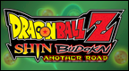

# Dragon Ball Z: Shin Budokai - Another Road

## PSP Saves - ULUS10234

| Icon | Filename | Description |
|------|----------|-------------|
|  | [00000151.zip](00000151.zip){: .btn .btn-purple } | All Fighters and forms except Majin Vegeta |
|  | [00000152.zip](00000152.zip){: .btn .btn-purple } | All Characters unlocked, SSJ4 Goku, Majin Vegita, all stamps, GAME 100% complete, 89% CITY P. |
|  | [00000153.zip](00000153.zip){: .btn .btn-purple } | All characters unlocked, 100% complete, 100% cities |
|  | [00000154.zip](00000154.zip){: .btn .btn-purple } | all characters unlock ,chapters 100%,unlocked super saiyan 4 goku |
|  | [00000155.zip](00000155.zip){: .btn .btn-purple } | 100% Complete, 100% City DF, All Z's in Another Road, All characters & forms, all stamps, sheets, and titles, All challenges complete, Both time trials done, 3,000,000+ zenie for cards/boosters. Takes up the last save slot |
