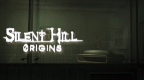

# Silent Hill: Origins

## PSP Saves - ULUS10285

| Icon | Filename | Description |
|------|----------|-------------|
|  | [00001034.zip](00001034.zip){: .btn .btn-purple } | 100% All weapons - All costumes |
|  | [00001035.zip](00001035.zip){: .btn .btn-purple } | Cleared File. Almost every "accolades" unlocked (it lacks the "Cartographer" one). |
|  | [00001036.zip](00001036.zip){: .btn .btn-purple } | Save 1: Final Savepoint. Save 2: New Game+ (Collector, Explorer, Savior, Stalker Accolades) |
|  | [00001037.zip](00001037.zip){: .btn .btn-purple } | Tesla Gun, Night Goggles, Extra Options unlocked. Accolades: Savior, Ambassador, Stalker, Collector, Sharpshooter, Explorer, Daredevil, Codebreaker (8/14 unlocked) |
|  | [00001038.zip](00001038.zip){: .btn .btn-purple } | Silent Hill origins 100% |
|  | [00001039.zip](00001039.zip){: .btn .btn-purple } | Extra Options, Nigh Vision Goggles, Tesla Gun Unlocked. All Accolades unlocked. 100% complete. |
|  | [00001040.zip](00001040.zip){: .btn .btn-purple } | 12/14 accolades, all costumes, all firearms and infinite ammo, all melee weapons and night goggles, saved at hospital |
