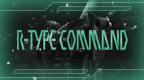

# R-Type Command

## PSP Saves - ULUS10343

| Icon | Filename | Description |
|------|----------|-------------|
|  | [00001201.zip](00001201.zip){: .btn .btn-purple } | 100% complete all missions cleared Human and Bydo |
|  | [00001202.zip](00001202.zip){: .btn .btn-purple } | True 100% Save almost all units purchased, All missions Earth and Bydo Finished, 2 bonus Gallery Pictures. |
|  | [00001203.zip](00001203.zip){: .btn .btn-purple } | Erath and bydo missions completed. all spoils obtained. play another 30 missions to unlock the 3 remaining gallery pictures |
