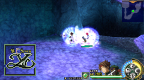

# Ys Seven

## PSP Saves - ULUS10551

| Icon | Filename | Description |
|------|----------|-------------|
|  | [00000349.zip](00000349.zip){: .btn .btn-purple } | Save before last boss. Nightmare mode. Adol level 67. 2.2m gold. All ultimate weapons and armors. All Quests completed. |
|  | [00000350.zip](00000350.zip){: .btn .btn-purple } | Save before last boss. Normal mode. Adol level 59. 1.7m gold. All items. All ultimate weapons and armor. All Synthesis, Monster Book and Quest complete. |
|  | [00000351.zip](00000351.zip){: .btn .btn-purple } | Normal Mode. Team Level 99. All Quests, Equipment, Synthesis. All Monster Book (except final boss and "Knight of Despair"). No cheats, codes, stats boosts used. 58 million+ gold. Clock at 156 hours+. |
|  | [00000352.zip](00000352.zip){: .btn .btn-purple } | Beginning of game, Max cash, Hard difficult |
