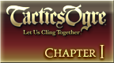

# Tactics Ogre: Let Us Cling Together

## PSP Saves - ULUS10565

| Icon | Filename | Description |
|------|----------|-------------|
|  | [00000808.zip](00000808.zip){: .btn .btn-purple } | Maxed items only - untouched Levels and Chaos Frame |
|  | [00000810.zip](00000810.zip){: .btn .btn-purple } | End game with all characters. 50% of classes at level 50, 50% at level 25, all items in the game. Slot 2 starts at "real" ending, Slot 3 starts just after with WORLD. |
|  | [00000811.zip](00000811.zip){: .btn .btn-purple } | CH1 All items/Classmarks x99 Max Valeria Chaos Frame |
|  | [00000812.zip](00000812.zip){: .btn .btn-purple } | Chapter 1 All items x99 |
|  | [00000814.zip](00000814.zip){: .btn .btn-purple } | Maxed items+Levels Chapter 1 Sav |
