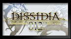

# Dissidia 012 Final Fantasy

## PSP Saves - ULUS10566

| Icon | Filename | Description |
|------|----------|-------------|
|  | [00000145.zip](00000145.zip){: .btn .btn-purple } | Story Mode 100%Labyrinth Mode 100%Accomplishments 100%PP Catalog 100%Player Icons 100%Summons 100%Museum 100%All characters level 100, AP mastered, and Rank SSSAll equipment and accessories including Labyrinth sets and exclusives. (Everything at least 1 quantity. Hacked accessories excluded but Qu'bia and Conflict items are added because they are battlegen'able.)All Moogle Mognet Friend CardsAll Player Titles on Friend Card excluding multiplayer-only onesAll Battle Tips and TutorialsWhat's not in it?My personal artifact itemsTime Attack clears for every characterHacked equipment and accessories6999 PvP build for every characterMultiplayer-only Player Titles on Friend CardChange log:X:\PSP\SAVEDATA\ULUS10566GameData0 |
