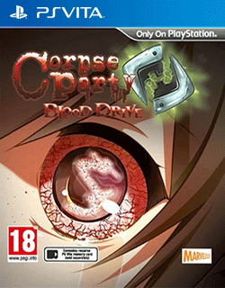

# Corpse Party: Blood Drive

## PS Vita Saves - PCSB00822

| Icon | Filename | Description |
|------|----------|-------------|
|  | [00000001.zip](00000001.zip){: .btn .btn-purple } | 100% completed, platinum. Don&#39;t know if trophies will pop up when you load it, since it&#39;s 100% and i suppose that you&#39;ll need to trigger them..  |
