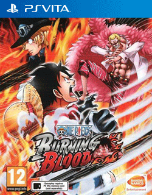

# One Piece Burning Blood

## PS Vita Saves - PCSB00893

| Icon | Filename | Description |
|------|----------|-------------|
|  | [00000001.zip](00000001.zip){: .btn .btn-purple } | 314  |
|  | [00000002.zip](00000002.zip){: .btn .btn-purple } | 1. Savegame: 100% Story, unlocked all Characters and support Characters, every Character at Max. Level, finished all Wanted Posters in S-Rank (update news in the game for Limited Wanted Posters access) 2. Savegame: every DLC Character at Max. Level  |
