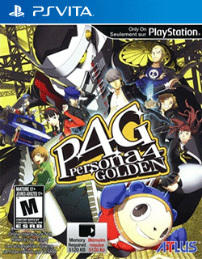

# Persona®4 Golden™

## PS Vita Saves - PCSE00120

| Icon | Filename | Description |
|------|----------|-------------|
|  | [00000001.zip](00000001.zip){: .btn .btn-purple } | New Game Plus #3, April 19th, 9 million yen, max social stats, compendium 78% complete  |
|  | [00000002.zip](00000002.zip){: .btn .btn-purple } | The location of this savefile is in the TV world. Story is currently on the last day of the void quest dungeon. When you enter the dungeon you are on the final floor. Orb of Darkness has been obtained. Yu Narukami is level 37.  |
|  | [00000003.zip](00000003.zip){: .btn .btn-purple } | story mode and post game finished, easy mode.   |
|  | [00000004.zip](00000004.zip){: .btn .btn-purple } | New game + ready Its got a full compendium and max social stats. First slot is the clear data, feel free to delete the rest of the saves if you wish.  |
